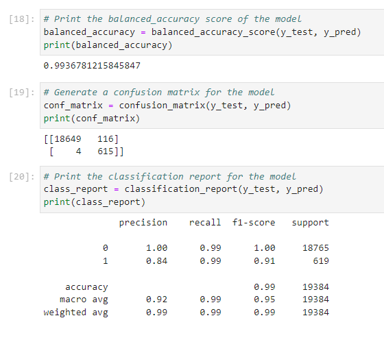

# Credit risk classification: an example of supervised learning   
Utilizes a dataset of historical lending activity from a peer-to-peer lending services company to build a model that can identify the creditworthiness of borrowers   

